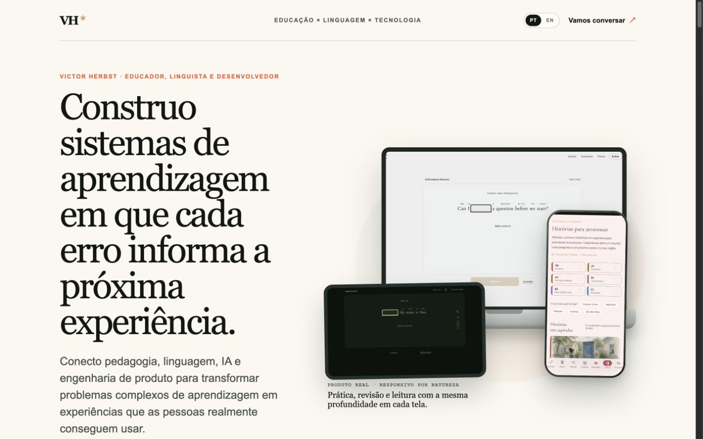
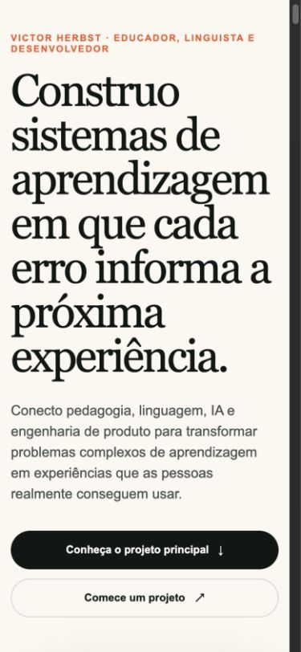
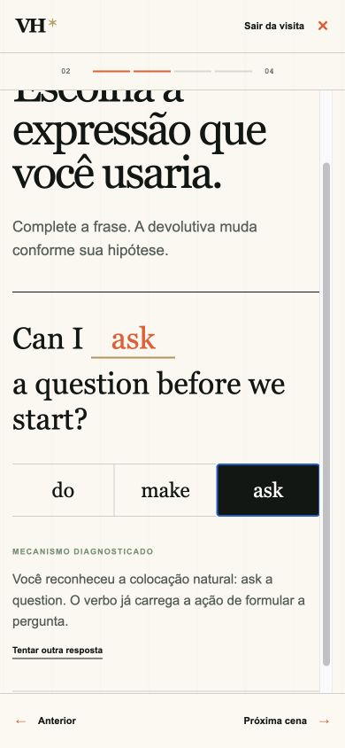
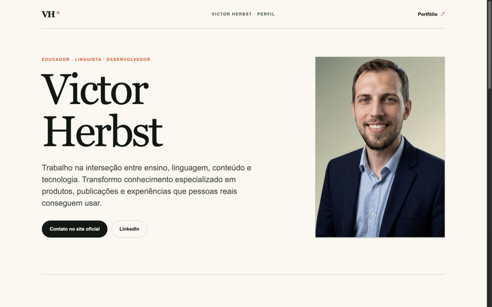

# Victor Herbst — Portfolio

[Português](#português) · [English](#english) · [Site ao vivo / Live site](https://victorherbst.com.br)



> Código público sanitizado do portfólio em produção em [victorherbst.com.br](https://victorherbst.com.br). O repositório contém somente a camada de apresentação e nenhum código privado dos produtos demonstrados.

<p align="center">
  
  
</p>



<a id="português"></a>

## Português

Este repositório apresenta a camada pública do portfólio de Victor Herbst: uma experiência bilíngue sobre educação, linguagem, sistemas editoriais e tecnologia aplicada. Ele foi preparado como vitrine técnica e não contém o histórico privado do projeto hospedado, credenciais, currículos, documentos completos nem o código-fonte dos produtos descritos nos cases.

### Cases em destaque

| Case | O que a vitrine demonstra | Limite público |
| --- | --- | --- |
| Céu Canto | Produto educacional responsivo, prática contextual, revisão e leitura | Screenshots e componentes de apresentação; sem aplicação, banco, autenticação ou lógica de produção |
| Visita guiada | Uma microexperiência de aprendizagem em quatro cenas | Demonstração autocontida e ilustrativa |
| Motores visuais | Movimento autoral, cor OKLCH e atmosferas adaptativas | Amostras delimitadas; sem forjas, pipelines ou runtimes proprietários |
| Livro Pronto | Arquitetura editorial, paginação e preflight | Imagens selecionadas; sem motor, fontes de livros ou PDFs completos |
| Myriad | Proveniência, contratos de transformação e autoria | Visualização de interface; sem orquestração, prompts, modelos ou implementação do motor |

### Stack

- Next.js 16 com App Router
- React 19 e TypeScript
- Hospedagem e previews pela Vercel
- CSS autoral, sem biblioteca de componentes

### Arquitetura

O espelho é intencionalmente autocontido: rotas e componentes React renderizam conteúdo editorial, pequenos datasets demonstrativos e imagens públicas. Não há banco, API privada, autenticação, analytics, pagamentos ou acesso a serviços de produção.

Leia [Arquitetura](docs/ARCHITECTURE.md) e [Auditoria de publicação](docs/PUBLICATION-AUDIT.md) para conhecer as fronteiras técnicas e as decisões de segurança.

### Executar localmente

Requisitos: Node.js 22.13 ou superior e pnpm 11.

```bash
pnpm install --frozen-lockfile
pnpm dev
```

Abra `http://localhost:3000`. Para verificar a versão de produção:

```bash
pnpm lint
pnpm build
```

O branch `main` alimenta a publicação de produção na Vercel. Pull requests e branches de trabalho recebem previews isoladas antes de qualquer promoção para o domínio oficial.

### Contribuição e licença

O branch `main` representa o snapshot público revisado. Mudanças devem partir de branches curtos e passar pelas verificações descritas em [CONTRIBUTING.md](CONTRIBUTING.md).

Este é um repositório source-available para avaliação profissional, não um projeto open source. Código, textos, marcas e imagens permanecem sob direitos reservados; consulte [LICENSE](LICENSE).

---

<a id="english"></a>

## English

This repository presents the public-facing layer of Victor Herbst's portfolio: a bilingual experience spanning education, language, editorial systems and applied technology. It is a technical showcase, not a copy of the hosted project's private history. It contains no credentials, résumés, full publications or source code for the products described in the case studies.

### Featured case studies

| Case study | What the showcase demonstrates | Public boundary |
| --- | --- | --- |
| Céu Canto | Responsive learning product, contextual practice, review and reading | Screenshots and presentation components only; no application, database, authentication or production logic |
| Guided visit | A four-scene learning micro-experience | Self-contained illustrative demo |
| Visual engines | Authored motion, OKLCH color and adaptive atmospheres | Bounded samples; no proprietary forges, pipelines or runtimes |
| Livro Pronto | Editorial architecture, pagination and preflight | Selected images; no engine, book sources or complete PDFs |
| Myriad | Provenance, transformation contracts and authorship | Interface visualization; no orchestration, prompts, models or engine implementation |

### Stack

- Next.js 16 with App Router
- React 19 and TypeScript
- Hosting and previews on Vercel
- Custom CSS with no component library

### Architecture

The mirror is intentionally self-contained: React routes and components render editorial copy, small demonstrative datasets and public images. It has no database, private API, authentication, analytics, payments or access to production services.

See [Architecture](docs/ARCHITECTURE.md) and [Publication audit](docs/PUBLICATION-AUDIT.md) for the technical boundaries and security decisions.

### Run locally

Requirements: Node.js 22.13 or newer and pnpm 11.

```bash
pnpm install --frozen-lockfile
pnpm dev
```

Open `http://localhost:3000`. To verify the production build:

```bash
pnpm lint
pnpm build
```

The `main` branch feeds the production deployment on Vercel. Pull requests and working branches receive isolated previews before any promotion to the official domain.

### Contributing and license

The `main` branch is the reviewed public snapshot. Changes should use short-lived branches and pass the checks in [CONTRIBUTING.md](CONTRIBUTING.md).

This is source-available for professional evaluation, not an open-source project. Code, writing, brands and images remain all rights reserved; see [LICENSE](LICENSE).

---

[victorherbst.com.br](https://victorherbst.com.br) · [LinkedIn](https://www.linkedin.com/in/victor-herbst-772362248/)
