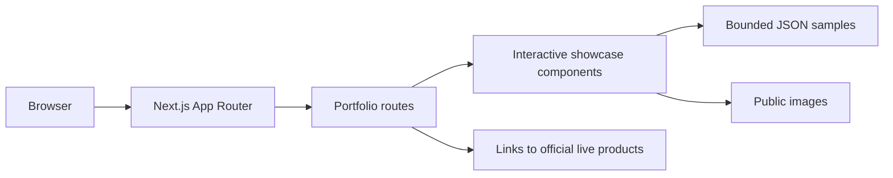

# Architecture / Arquitetura

## Public runtime

The repository contains a presentation-only application. The home route provides the bilingual portfolio and interactive demonstrations; `/sobre` provides the public profile. Both are rendered from source-controlled copy and local assets.

O repositório contém apenas uma aplicação de apresentação. A rota inicial reúne o portfólio bilíngue e demonstrações interativas; `/sobre` apresenta o perfil público. As duas rotas usam conteúdo versionado e assets locais.

## Project map

| Path | Responsibility |
| --- | --- |
| `app/page.tsx` | Bilingual portfolio composition and case-study content |
| `app/sobre/page.tsx` | Public profile route |
| `app/components/` | Self-contained interactive demonstrations |
| `app/data/` | Small, bounded visual-proof datasets; not engine source |
| `app/globals.css` | Complete visual system and responsive behavior |
| `public/` | Reviewed portfolio imagery and editorial samples |
| `docs/` | Architecture, screenshots and publication decisions |

## Deliberate boundaries

- No production database, migrations or database identifiers.
- No authentication, session handling or user records.
- No payment, analytics or messaging integrations.
- No environment variables or secret-bearing configuration.
- No complete source for Céu Canto, Myriad, Livro Pronto or third-party projects.
- No full-length books, résumés or downloadable PDFs.
- Contact actions route visitors to the official live site instead of embedding private contact details.

The public application uses the native Next.js build. Vercel hosts preview and production deployments from the reviewed GitHub source; no provider credential or production identifier is stored in the repository.

## Maintenance model

`main` is the canonical reviewed production source. Updates should be prepared on a short-lived branch and merged only after lint, build and preview verification succeed.
